#### 前言

  - 从.net开发转移Java开发的不适应点
    - String vs string 大小写的肌肉记忆
    - Integer vs int?/int  
    - java stream vs .net linq 本期话题

#### 函数式编程

  - 定义:函数式编程是一种编程范式。它把计算当成是数学函数的求值，从而避免改变状态和使用可变数据。它是一种声明式的编程范式，通过表达式和声明而不是语句来编程。
    - 理解 将计算过程写成一系列嵌套的函数调用
       - var result =method2(method1(method0(a,b),b));
    - 函数
      - 数学中的函数是输入元素的集合到可能的输出元素的集合之间的映射关系，并且每个输入元素只能映射到一个输出元素。
        
    - 操作函数:函数可以当作输入，或作为其它函数的输出返回
      - Function<T,R>,Consumer,Predicate,Supplier,ect.
    
        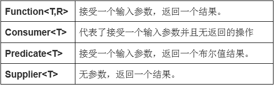
        ```
        public class CustomLogoutSuccessHandler implements LogoutSuccessHandler {

            protected final Log logger = LogFactory.getLog(this.getClass());
            private void executing(HttpServletResponse response){
                onResponseExecuting.accept(response);
            };
            public Consumer<HttpServletResponse> onResponseExecuting= rsp->{};

            @Override
            public void onLogoutSuccess(HttpServletRequest request, HttpServletResponse response, Authentication authentication){
                response.setCharacterEncoding("UTF-8");
                if(response.isCommitted()){
                    logger.debug("Response has already been committed. Unable to rewrite");
                    return;
                }
                executing(response);
            }
        }
        ```

### Java Stream

  - 一系列叠加的操作以双向链表形式组织构成的管道。
  
    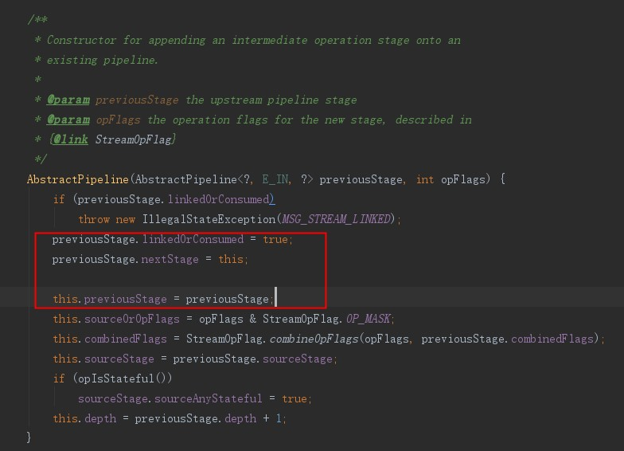
  - 操作类型
    - exmaple
      ```
      public void intermediateAndTerminalOperations(){
          System.out.println("begin");
          Stream stream=list.stream()
                  .filter(f->{
                      System.out.println("filter1");
                      return true;
                  })
                  .map(m->{
                      System.out.println("map1");
                      return m+1;
                  })
                  .filter(m->{
                      System.out.println("filter2");
                      return true;
                  })
                  .sorted(Comparator.comparing(s->{
                      System.out.println("comparing1");
                      return s;
                  }))
                  .skip(3);
          stream=stream.filter(f->{
              System.out.println("filter3");
              return true;
          });
          System.out.println("break");
          stream.collect(Collectors.toList());
          System.out.println("end");
      }
      ```
    - 中间操作(intermediate):返回叠加后的操作(Stream<T>)
      - StatefulOp:
        - 有状态操作
        - 作用于所有元素的集合上
        - distinct(), sorted(), limit(), skip()
      - StatelessOp
        - 无状态操作
        - 作用于单个元素上
        - All other intermediate operations
    - 结束操作(terminal):返回最终的结果
    - 管道具体的调用方式:
      - begin()->accept()->cancellationRequested()->end()
      - wrapSink:将所有的调用链包成一个
        - onWrapSink
        - 注:interface Sink<T> extends Consumer<T> 本质是一个Consumer、
          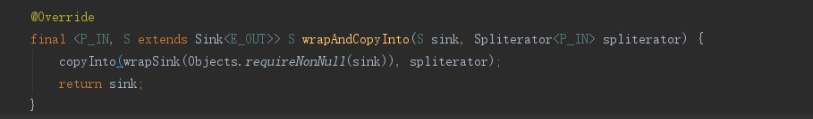 
          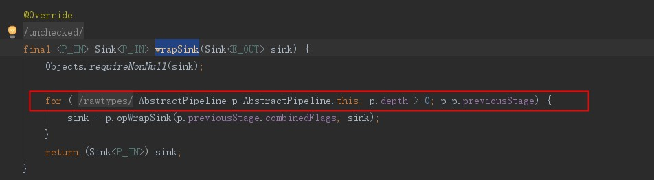
          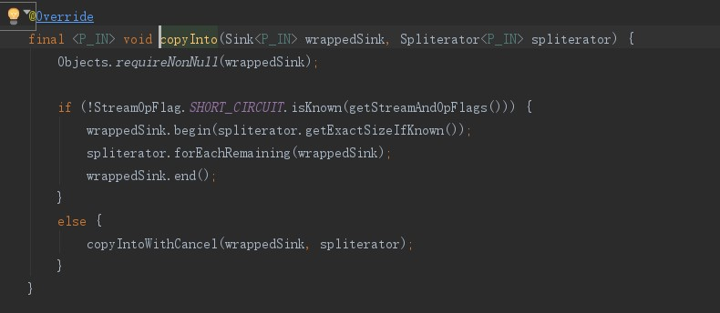

      - begin:重置接收器状态以接收新的数据集。在向接收器发送任何数据之前，必须调用此操作。在调用end()之后，您可以调用此方法重置另一个计算的接收器。已知,或未知则-1将推入下游的数据的确切大小。在这个调用之前，sink必须处于初始状态，在这个调用之后，它处于活动状态。
      - accept:对给定参数执行此操作。
      - cancellationRequested:取消请求,指示此不希望接收任何其他数据。
      - end:表示所有元素都已被推送。如果Sink是有状态的，那么此时它应该向下游发送任何存储的状态，并且应该清除任何累积的状态(以及相关的资源)。调用之前，sink必须处于活动状态，调用之后返回初始状态。
        - .filter
        
          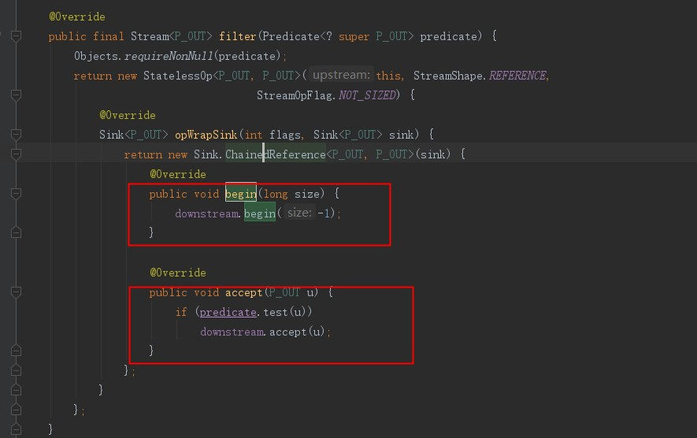
        - .sorted
        
          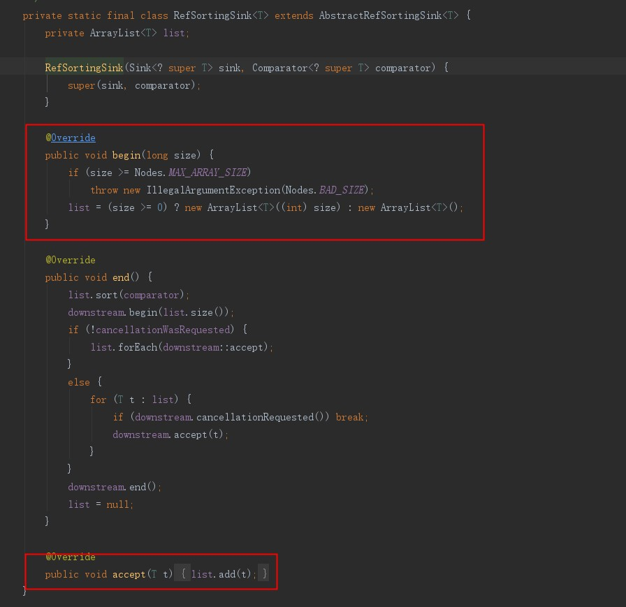
        - .findFirst
        
          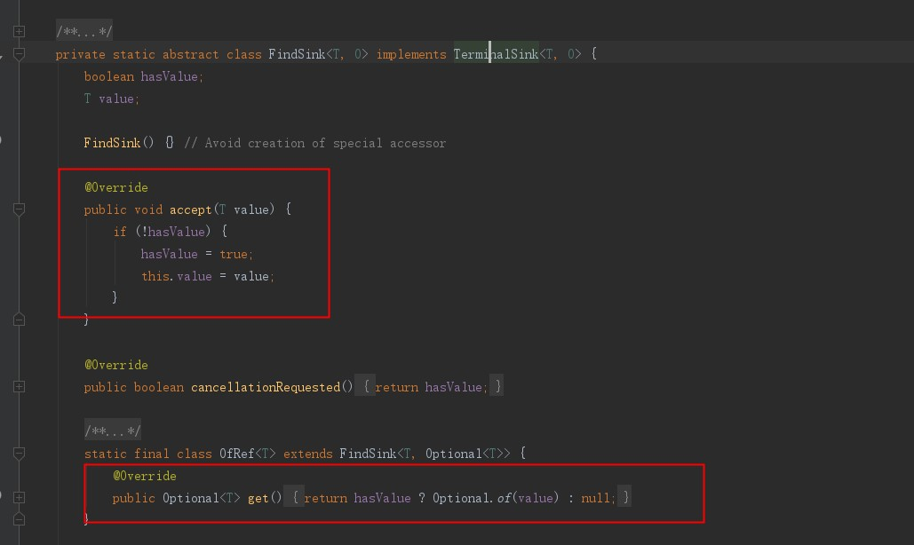
        - .collect
        
          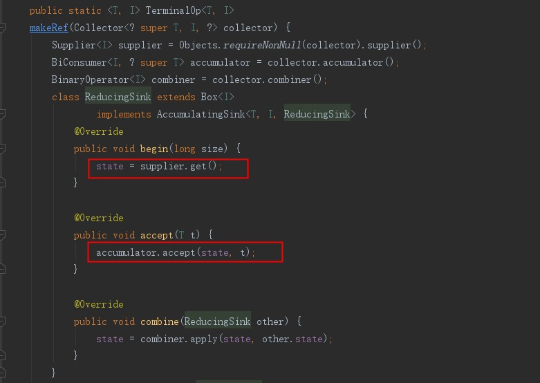
    - 类图
    
      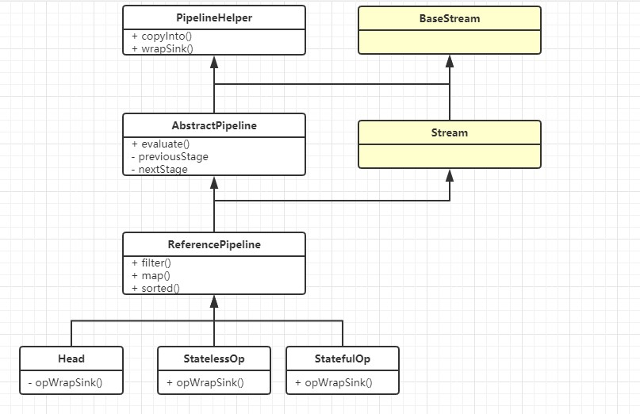

### .NET LINQ
  - Lambda 表达式
    - 提供匿名方法
  - 扩展方法(不是Java的default方法)
    - 允许在不修改代码的情况下添加新的方法，提高扩展性
  - *表达式树*
    - 可以由lambda直接转化
      -  class Expression<TDelegate> : LambdaExpression
    - 可以编译成可执行的委托(匿名函数)
    - 将代码逻辑存储在树结构中,通过解析树结构,动态的执行代码
    - var result=>a+b*c-d;
    
      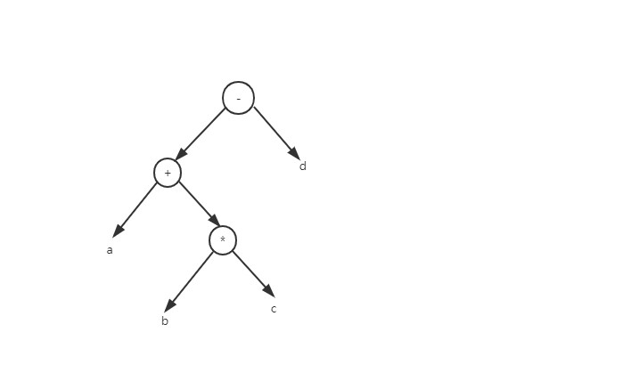
  - 匿名类型
  - Query 表达式
    - 提供不同的数据查询方式
      - linq to object
        - 基于集合数据查询IEnumerable<T>数据 略过。
    - 对于自定义数据的查询
    - 典型的是sql查询
  - linq to sql
    - 延迟加载
    - 目标:根据输出sql
      - 生成表达式树
        - IQueryable<T>
          - [link](https://docs.microsoft.com/zh-cn/dotnet/api/system.linq.iqueryable-1?view=netframework-4.8)
          - 提供对数据类型已知的特定数据源的查询进行计算的功能
          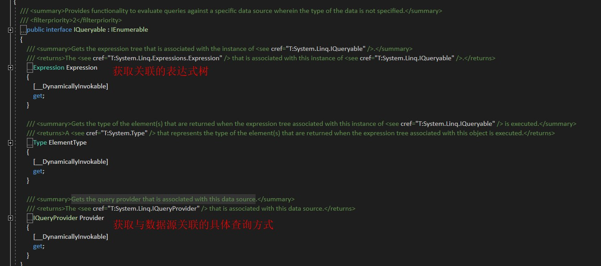
        - IQueryProvider
          - [link](https://docs.microsoft.com/zh-cn/dotnet/api/system.linq.iqueryprovider?view=netframework-4.8)
          - 定义用于创建和执行 IQueryable 对象所描述的查询的方法
          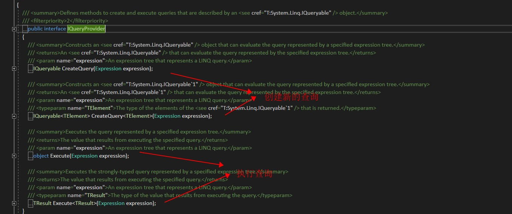
        - HQuery
        
          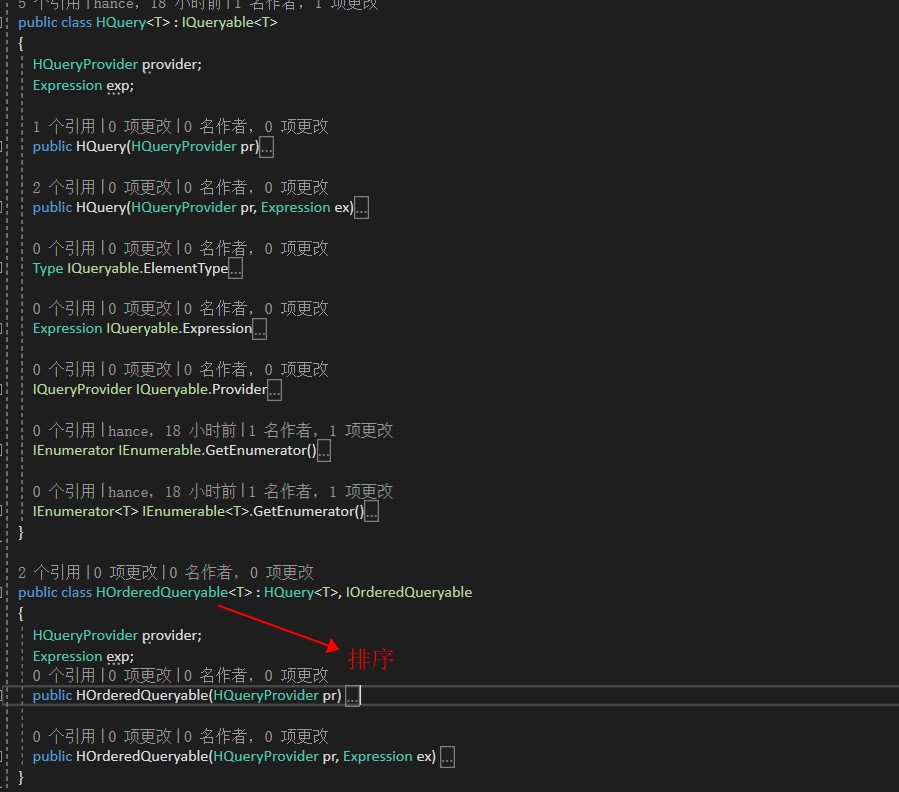
        - HQueryProvider
        
          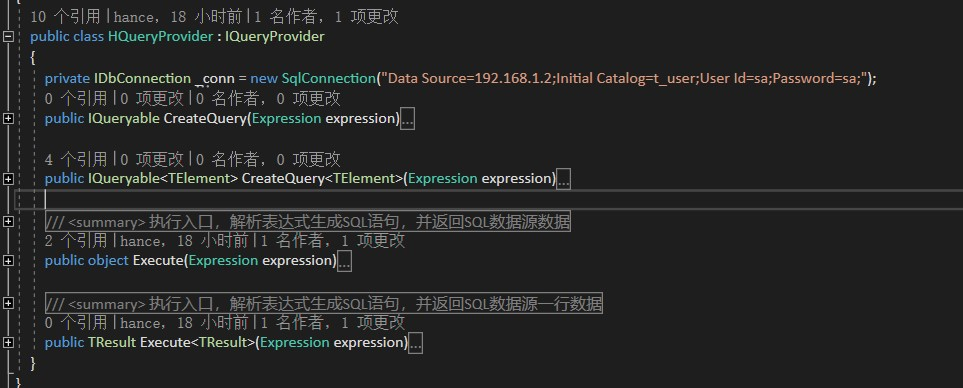
      - 解析表达式树
        - ExpressionVisitor 
          - [link](https://docs.microsoft.com/zh-cn/dotnet/api/system.linq.expressions.expressionvisitor?view=netframework-4.8)
          - 继承来创建更专业化的类，其功能需要遍历、检查或复制表达式树
        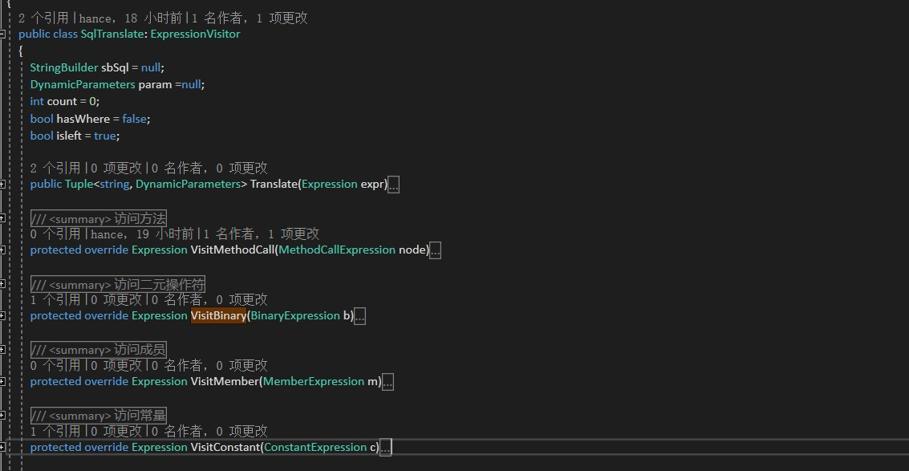
        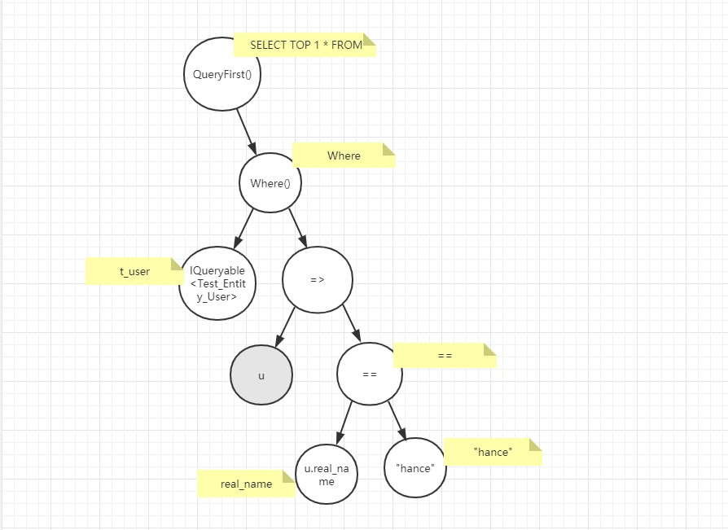

### JAVA POOR LINQ

  - [link](https://github.com/MeetOct/linq-to-sql)