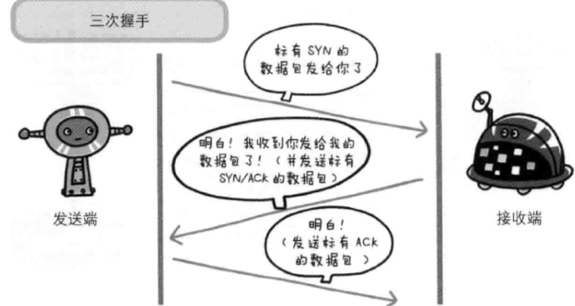

<h2 style='text-align:center'>深入浅出Http协议</h1>

+ ## Http基础

    - ### 简述
    
        http协议（*超文本传输协议*）为了Web上的信息共享而诞生
    
        三个版本：0.9; 1.0; 1.1

    - ### 网络基础

        建立在TCP/IP协议族的基础之上

        * TCP/IP协议族

            1. 应用层：决定了向用户提供应用服务时的通信活动，如FTP，DNS和HTTP等；

            2. 传输层：提供处于网络连接中的两台计算机之间的数据传输，TCP，UDP；

            3. 网络层：用来处理网络上流动的数据包，IP协议；

            4. 链路层：网络连接的硬件部分。

            数据在各层中封装后进行传输

            

            

        * IP协议
        
            IP协议的作用是把各种数据包传送给接收方，其中IP地址和MAC地址用于确定接收方的位置。IP地址可以通过ARP协议（*Adress Resolution Protocol*） 反查出对应的MAC地址

            

        * TCP协议

            TCP协议能够将数据准确可靠地传输给接收方,(*三次握手*)。

            

        * DNS服务

            DNS服务位于应用层。它提供域名到IP地址之间的解析服务

            域名易于人类理解，IP地址易于计算机理解

            

    - ### 简单结构

        http协议用于客户端与服务端之间的通信，切为无状态协议。

        通过URI（*Uniform Resource Identifier 统一资源标志符*）定位请求资源，url是URL的一个自己

        http方法，常用 post，get

        

        一个页面一般会存在很多资源请求，如图片，脚本等资源。每一个请求都进行打开关闭TCP连接操作，增加了通信的开销，页面的加载速度也会变慢。因此，http中又有了持久连接的机制。建立一次连接后可进行多次客户端与服务端之间的交互，直到其中一方明确表示需要断开连接。

        

        

        在持久连接基础上可以实现管线化，可以同时发送多个请求。

        

        http协议的无状态特性可以减少服务器的CPU以及内存资源的消耗，却也因此无法对用户进行认证。所以就有了Cookie来管理状态，将消耗分担到了每个客户端。

+ ## HTTP信息

    - ### 报文信息

        客户端的Htpp报文叫做请求报文，服务器端的Http报文叫响应报文，报文使用CR+LF作为换行符

        报文分为报文首部和报文主体,报文首部一般有四种：通用首部，请求首部，响应首部和实体首部；在客户端与服务器之间进行通信过程中，无论是请求首部还是响应首部都能起到传递额外重要信息的作用，如报文主体大小，所使用的的语言和认证信息等等

        

        

        

        * 通用字段

            1. Cache-Control：用于操作缓存的工作机制，如缓存时间，是否必须向服务器确认等

            2. Connection：控制不再转发给代理的首部字段和持久连接，http1.1版本默认的连接都是持久连接

            3. Date：表明创建Http报文的日期和时间

            4. Transfer-Encoding：规定传输报文主体时采用的编码方式

        * 请求首部

            1. Accept：通知服务器客户端可以处理的媒体类型以及媒体类型的相对优先级，如 application/json,text/html，image/jpeg等。优先级使用*q=*来表示权重，最大值为1，默认权重为1.0

            2. Accept-Language:通知服务器客户端可以处理的语言集以及相对优先级

            3. Authorization：用于高速服务区客户端的认证信息。通常在接收到服务器返回的401状态码后，客户端将Authorization加入请求中

            4. Host：http1.1规范中唯一一个必须包含在请求内的首部字段，可为空

            5. User-Agent：创建请求的浏览器名称等信息

        * 响应首部

            1. Location：提供重定向的资源地址

            2. Server：服务器上安装的http服务器应程序信息

        * 为Cookie服务的首部字段

            1. Set-Cookie：开始状态管理所使用的Cookie信息（*响应首部*），管理服务器端设置的cookie信息，如expires过期时间，domain所属域名和httponly等

            2. Cookie：服务器端收到的Cookie信息（*请求首部*）

    - ### 状态码

        状态码用于描述服务器端返回的请求结果状态，是正常，错误还是其他。
        
        

        1. 200（*ok*）:服务器正常处理了请求

        2. 304（*Not Modified*）:资源未发生变动，一般浏览器会使用已经缓存过的资源

        3. 401（*UNauthorized*）:第一次返回表示需要认证，第二次则是表示认证失败

        4. 403（*Forbidden*）:请求资源的访问被服务器拒绝

        5. 404（*Not Found*）:服务器上不存在请求的资源

        6. 500（*Internal Server Error*）:服务器内部错误

+ ## HTTP与Web

    - ### Web服务器

        一般，在互联网上域名通过DNS服务器域名解析后映射到IP地址再访问目标网站

        由于虚拟主机的功能，在相同的IP地址下可以部署多个不同域名的Web站点，因此在发送HTTP请求时必须在Host首部内完善域名

        * 通信数据的转发

            1. 代理：扮演位于服务器与客户端中间人的角色，它接受客户端的请求转发给服务器，同时也接受服务器的返回结果并转发给客户端

            

            缓存代理：预先将服务器上的资源副本缓存在代理服务器上，当客户端对这些已经缓存过了的资源发出请求时，代理不会对服务器发出请求，而是直接返回缓存的资源

            2. 网关：接收客户端发送过来的请求，并自行进行处理，利用网关可以将http请求转化为飞http请求，可以提高通信的安全性
            
            

            3. 隧道：用于保持客户端与服务器端通信连接的应用程序，会使用SSL等加密手段进行通信，用于保证客户端与服务器之间通信的安全
            
            

    - ### HTTPS

        * HTTP的缺点

            1. 通信使用明文，可能会被窃听

            2. 不会验证通信方的身份，可能遭遇伪装

            3. 无法证明报文的完整性，可能遭到篡改

        用SSL将通信的报文主体内容进行加密，使用SSL建立http的安全通信线路，SSL处于http与TCP通信之间，这样的SSL与HTTP组合被称为HTTPS

        

        使用第三方证书来验证通信双方身份

        

        HTTPS由于存在SSL加密，必不可免的会使处理速度会变慢

    - ## Web构建

        html，css和控制DOM来改变html元素的JavaScript

        -》html5 ，vuejs,angularjs等等

        数据格式：xml，json

    - ## Web安全

        * Web攻击技术

            1. SQL注入

                欺骗服务器执行恶意的SQL命令

            2. XSS（*跨站脚本攻击*）

                黑客在HTML页面内注入恶意脚本，当其他用户浏览该网页时，恶意脚本被执行

            3. 会话劫持

            4. CSRF（*跨站请求伪造*）

                黑客在HTML页面内注入恶意脚本，当其他用户浏览该网页时，在不通知用户的情况下对其他站点发送请求

            5. 点击劫持

                用一个透明的域覆盖在网页某个位置上，当用户点击该位置时，触发脚本

            6. DDoS（*分布式拒绝服务*）

